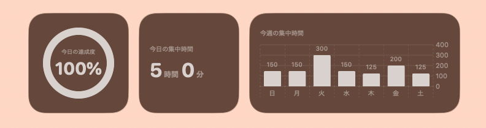
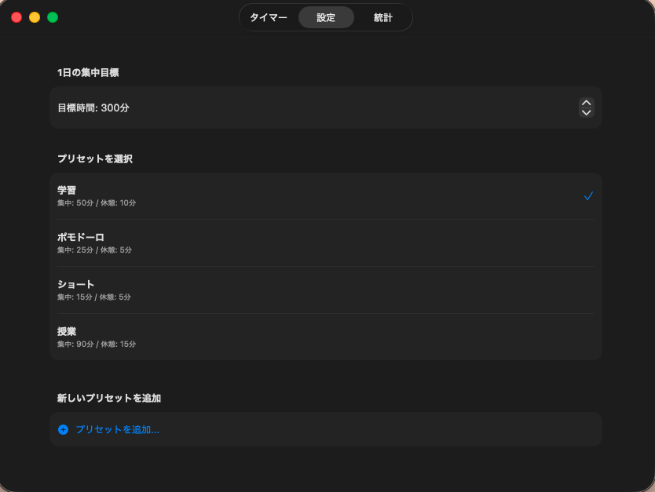
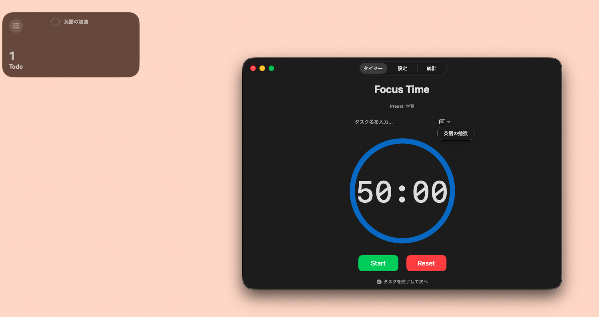
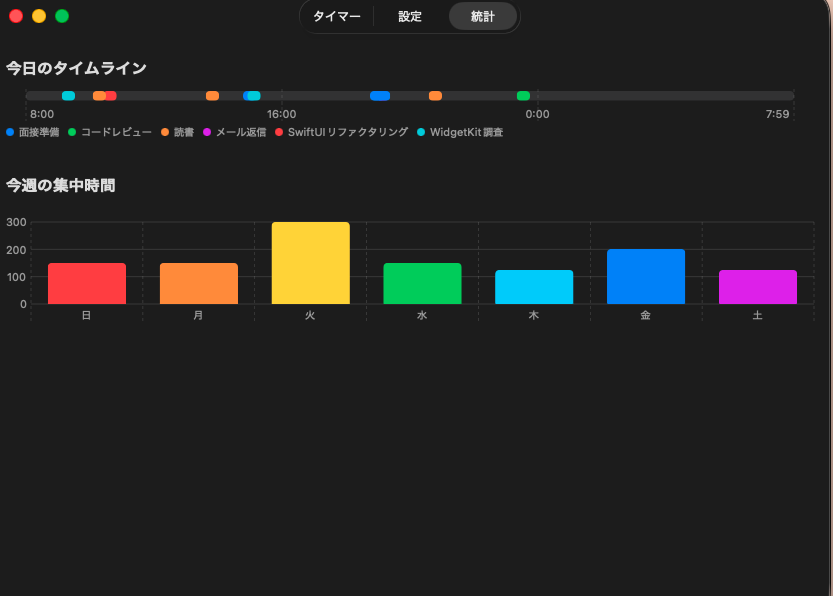

# FocusTimer ⏱️

**Macのメニューバーに常駐し、あなたの集中を可視化するポモドーロ・トラッカー**

FocusTimerは、作業への没入をサポートし、日々の積み重ねをデスクトップ上で美しく可視化するために開発されたMac向けネイティブアプリケーションです。

  

## 📑 目次
- [🚀 アプリの主な特徴](#-アプリの主な特徴)
- [🛠️ 使用技術・アーキテクチャ](#️-使用技術アーキテクチャ)
- [💡 開発の背景](#-開発の背景)

## 🚀 アプリの主な特徴

*   **メニューバー常駐 & 自動ポップオーバー**  
    Macのメニューバーに常駐し、いつでもワンクリックでタイマーにアクセス可能。
    タイマー終了時（集中・休憩の切り替え時）には、他のアプリを操作していても自動的にポップオーバーが展開し、シームレスに次のアクションへ移行できます。
    

      
    

*   **多彩なデスクトップウィジェット (WidgetKit)**  
    ウィジェットギャラリーから選べる複数のサイズに対応。`SwiftUI Charts` を活用した週間グラフや、1日のデイリーゴール達成度をリングUIで表示し、モチベーションを維持します。
    

      
    

*   **用途に合わせたプリセット管理 & 目標設定**  
    「ポモドーロ（25分/5分）」や「学習（50分/10分）」、「授業（90分/15分）」など、作業スタイルに応じたタイマーをワンクリックで切り替え。カスタムプリセットの追加や、ウィジェットと連動する1日の集中目標時間も自由にカスタマイズ可能です。
    

      
    

*   **タスク管理 & Apple「リマインダー」連携**  
    OS標準のリマインダーアプリからタスクを同期・読み込み可能。
    「完了して次へ」ボタンで、タイマーの進行を止めることなくタスクを連続してこなしていく体験を実現しました。
    

      
    

*   **詳細な統計とタイムライングラフ**  
    朝8時を起点とした24時間のタイムラインを実装。いつ、どのタスクに集中したかを視覚的に振り返ることができます。
    

      
    

*   **クラウド同期 (FastAPI + データベース)**  
    バックエンドに FastAPI を採用し、記録データはリアルタイムに保存され、複数端末やバックグラウンドでの安定したデータ管理を実現しています。

## 🛠️ 使用技術・アーキテクチャ

本プロジェクトは、iOS/macOSネイティブ開発技術とモダンなWebバックエンド技術を組み合わせてフルスタックで構築されています。

### Frontend (macOS App & Widget)
*   **言語**: Swift
*   **フレームワーク**: SwiftUI, WidgetKit
*   **アーキテクチャ**: MVVMパターン
*   **データ共有**: `App Groups` (`UserDefaults`) を用いたメインアプリとウィジェット拡張間のセキュアなデータ同期
*   **UI/UX**: `SwiftUI Charts` を用いた高度なグラフ描画、`NSStatusItem` / `NSPopover` による常駐・ポップオーバー制御、`NotificationCenter` を用いた状態監視とウィンドウ制御

### Backend & Infrastructure
*   **言語**: Python 3.x
*   **フレームワーク**: FastAPI
*   **データベース**: PostgreSQL (Supabase)
*   **ORM**: SQLAlchemy
*   **インフラ・ホスティング**: Render

## 💡 開発の背景

「毎日の作業のモチベーションを高めるために、いつでも目に入るデスクトップに美しく、かつ作業の邪魔にならないタイマーが欲しい」という個人的な課題から本アプリの開発をスタートしました。

ブラウザ上で動くWebアプリではなく、あえて **macOSネイティブアプリ** として設計することで、以下のような「OSと深く統合された、触り心地の良い体験」の実現を目指しました。

*   `NSStatusItem` / `NSPopover` を活用した、いつでもアクセスできるメニューバー常駐
*   `WidgetKit` を用いた、日々の積み重ね（グラフや達成度）の美しい可視化
*   `EventKit` を通じた、OS標準のリマインダーアプリとのシームレスなタスク連携

「自分が毎日使いたくなるツール」というユーザー体験（UX）の理想形を起点に、SwiftUIによるフロントエンドからFastAPI/Supabaseによるバックエンドまで、必要な技術要素を組み合わせながら形にしたプロダクトです。
