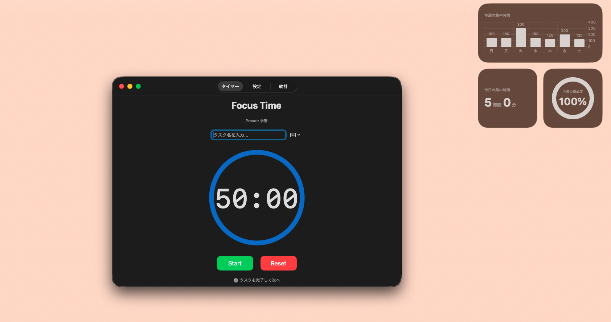

# FocusTimer ⏱️

**Macのメニューバーに常駐し、あなたの集中を可視化するポモドーロ・トラッカー**

FocusTimerは、作業への没入をサポートし、日々の積み重ねをデスクトップ上で美しく可視化するために開発されたMac向けネイティブアプリケーションです。

  <!-- ※ここにアプリのメイン画面や利用シーンがわかるデモGIFを配置すると非常に魅力的になります -->
  

## 📑 目次
- [🚀 アプリの主な特徴](#-アプリの主な特徴)
- [🛠️ 使用技術・アーキテクチャ](#-使用技術アーキテクチャ)

- [💡 開発の背景とアピールポイント](#-開発の背景とアピールポイント)

## 🚀 アプリの主な特徴

*   **メニューバー常駐 & 自動ポップオーバー**
    Macのメニューバーに常駐し、いつでもワンクリックでタイマーにアクセス可能。
    タイマー終了時（集中・休憩の切り替え時）には、他のアプリを操作していても自動的にポップオーバーが展開し、シームレスに次のアクションへ移行できます。
    > *(💡 画像配置の工夫: ここにポップオーバーが自動展開する様子を伝える短いGIF画像を置くと使用感が伝わります)*

*   **多彩なデスクトップウィジェット (WidgetKit)**
    ウィジェットギャラリーから選べる複数のサイズに対応。`SwiftUI Charts` を活用した週間グラフや、1日のデイリーゴール達成度をリングUIで表示し、モチベーションを維持します。
    > *(💡 画像配置の工夫: ここにウィジェット（Small, Medium, Largeなど）のバリエーションを示すスクリーンショットを横並びで配置するのがおすすめです)*

*   **タスク管理 & Apple「リマインダー」連携**
    OS標準のリマインダーアプリからタスクを同期・読み込み可能。
    「完了して次へ」ボタンで、タイマーの進行を止めることなくタスクを連続してこなしていく体験を実現しました。

*   **詳細な統計とタイムライングラフ**
    朝8時を起点とした24時間のタイムラインを実装。いつ、どのタスクに集中したかを視覚的に振り返ることができます。
    > *(💡 画像配置の工夫: ここにタイムライングラフや統計画面のスクリーンショットを追加します)*

*   **クラウド同期 (FastAPI + データベース)**
    バックエンドに FastAPI を採用し、記録データはリアルタイムに保存され、複数端末やバックグラウンドでの安定したデータ管理を実現しています。

## 🛠️ 使用技術・アーキテクチャ

本プロジェクトは、iOS/macOSネイティブ開発技術とモダンなWebバックエンド技術を組み合わせてフルスタックで構築されています。

### Frontend (macOS App & Widget)
*   **言語**: Swift
*   **フレームワーク**: SwiftUI, WidgetKit
*   **アーキテクチャ**: MVVMパターン
*   **データ共有**: `App Groups` (`UserDefaults`) を用いたメインアプリとウィジェット拡張間のセキュアなデータ同期
*   **UI/UX**: `SwiftUI Charts` を用いた高度なグラフ描画、`MenuBarExtra` を用いた常駐アプリ化、`NotificationCenter` を用いた状態監視とウィンドウ制御

### Backend & Infrastructure
*   **言語**: Python 3.x
*   **フレームワーク**: FastAPI
*   **データベース**: PostgreSQL (Supabase)
*   **ORM**: SQLAlchemy
*   **インフラ・ホスティング**: Render

## 💡 開発の背景とアピールポイント（就職活動用）

**1. ユーザー体験（UX）から逆算した技術選定**
「毎日の作業のモチベーションを高めるために、いつでも目に入るデスクトップに美しいウィジェットを置きたい」という課題からスタートしました。目的を達成するために最適な手段として Apple 独自の `WidgetKit` および `SwiftUI` をキャッチアップして採用し、データの永続化や集計処理には自身の得意領域である `Python (FastAPI)` をバックエンドとして組み合わせるなど、柔軟で実践的な技術選定を行いました。

**2. フルスタックでのシステム全体の設計・構築**
フロントエンド（Macアプリ・ウィジェット）のUI設計から、バックエンド（API）のルーティング実装、そしてデータベースのスキーマ構築まで、一つのプロダクトの全貌を個人で作り上げました。APIによる通信やデータの流れなど、システム全体の構造と連携を深く理解して実装しています。

**3. OSのネイティブ機能への深いアクセスと活用**
単なる画面の作成にとどまらず、`MenuBarExtra` による常駐化、`NSWorkspace` や `NotificationCenter` を活用したウィンドウのアクティブ化、`EventKit` を使ったOS標準リマインダーとの連携など、macOSのネイティブAPIを積極的に調査・活用しました。OSと深く統合された「触り心地の良いアプリケーション」を追求する姿勢を持っています。
